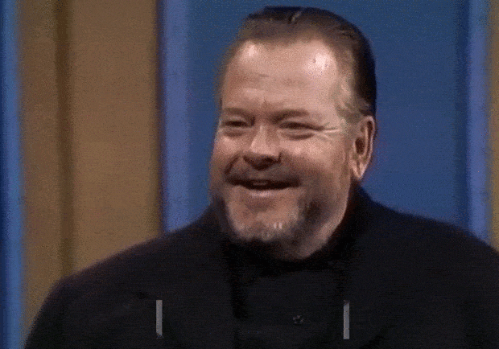

uses threejs (react-three-fiber) to generate the animated name labels that oft appear on talk shows. The color scheme is fairly uninspired but I'm happy with the animation.

Here's an example of Orson Welles (taken from The Dick Cavett Show):

and another example of Paul Thomas Anderson (taken from Jimmy Kimmel Live)

